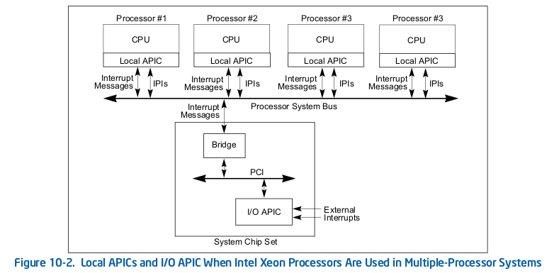

## qemu 中断虚拟化框架分析

本节从qemu模拟的i8259a(PIC)和IOAPIC出发，结合qemu-kvm下虚拟化原理来分析qemu中断虚拟化框架。

### 1. 中断控制器的创建和初始化
考虑到中断实时性对性能的影响，PIC和IOAPIC的设备模拟主要逻辑都放到了kvm模块进行实现。
i8259控制器和IOAPIC的初始化流程如下：

#### (1)中断控制器的创建
qemu代码中中断控制器的创建流程为：

    configure_accelerator
        |--> accel_init_machine
            |--> kvm_init
                |--> kvm_irqchip_create
                    |--> kvm_vm_ioctl(s, KVM_CREATE_IRQCHIP)
                    |--> kvm_init_irq_routing

qemu通过kvm的ioctl命令KVM_CREATE_IRQCHIP调用到kvm内核模块中，在内核模块中创建和初始化PIC/IOAPIC设备（创建设备对应的数据结构并将设备注册到总线上）。

    kvm_arch_vm_ioctl(s, KVM_CREATE_IRQCHIP)
        |--> kvm_pic_init                    /* i8259 初始化 */
        |--> kvm_ioapic_init                 /* ioapic 初始化 */
        |--> kvm_setup_default_irq_routing   /* 初始化缺省的IRE */

qemu在kvm内核中创建完成PIC和IOAPIC后将全局变量*kvm_kernel_irqchip*置为true，kvm模块则将kvm->arch.irqchip_mode 赋值为 KVM_IRQCHIP_KERNEL。PIC由2个i8259进行“级联”，一个为master一个为slave，每个i8259有8个PIN（salve的INT输出线连接到master的IRQ2引脚上,所以实际可用的IRQ数目为15）。目前kvm只为虚拟机创建一个ioapic设备（现在物理CPU可能有多个ioapic设备），ioapic设备提供24个PIN给外部中断使用。在IRQ路由上 0-15号GSI为PIC和IOAPIC共用的，16-23号GSI则都分配给ioapic。

几个概念要理清楚：IRQ号，中断向量，GSI。
*   IRQ号是PIC时代引入的概念,由于ISA设备通常是直接连接到到固定的引脚，所以对于IRQ号描述了设备连接到了PIC的哪个引脚上，同IRQ号直接和中断优先级相关,例如IRQ0比IRQ3的中断优先级更高。
*   GSI号是ACPI引入的概念，全称是Global System Interrupt，用于为系统中每个中断源指定一个唯一的中断编号。注：ACPI Spec规定PIC的IRQ号必须对应到GSI0-GSI15上。kvm默认支持最大1024个GSI。
*   中断向量是针对逻辑CPU的概念，用来表示中断在IDT表的索引号，每个IRQ（或者GSI）最后都会被定向到某个Vecotor上。对于PIC上的中断，中断向量 = 32(start vector) + IRQ号。在IOAPIC上的中断被分配的中断向量则是由操作系统分配。

PIC主要针对与传统的单核处理器体系结构，在SMP系统上则是通过IOAPIC和每个CPU内部的LAPIC来构成整个中断系统的。

如上图所描述，IOAPIC 负责接受中断并将中断格式化化成中断消息，并按照一定规则转发给LAPIC。LAPIC内部有IRR(Interrupt Reguest Register)和ISR(Interrupt Service Register)等2个重要寄存器。系统在处理一个vector的同时缓存着一个相同的vector，vector通过2个256-bit寄存器标志，对应位置位则表示上报了vector请求或者正在处理中。另外LAPIC提供了TPR(Task Priority Register)，PPR(Processor Priority Register)来设置LAPIC的task优先级和CPU的优先级，当IOAPIC转发的终端vector优先级小于LAPIC设置的TPR时，此中断不能打断当前cpu上运行的task；当中断vector的优先级小于LAPIC设置的PPR时此cpu不处理这个中断。操作系统通过动态设置TPR和PPR来实现系统的实时性需求和中断负载均衡。

IOAPIC为了实现中断路由(Interrupt Routing)会维护一个中断路由表信息，内核中相关的数据结构为:

    struct kvm_irq_routing {
        __u32 nr;
        __u32 flags;
        struct kvm_irq_routing_entry entries[0];
    };

    struct kvm_irq_routing_entry {
        __u32 gsi;
        __u32 type;
        __u32 flags;
        __u32 pad;
        union {
            struct kvm_irq_routing_irqchip irqchip;
            struct kvm_irq_routing_msi msi;
            struct kvm_irq_routing_s390_adapter adapter;
            struct kvm_irq_routing_hv_sint hv_sint;
            __u32 pad[8];
        } u;
    };

#### (2) 用户态和内核态的中断关联
中断处理的逻辑放在kvm内核模块中进行实现，但设备的模拟呈现还是需要qemu设备模拟器来搞定，最后qemu和kvm一起配合完成快速中断处理的流程。

i8259的初始化流程：

    machine_run_board_init
        |--> pc_init1
            |--> if (kvm_pic_in_kernel())
                |--> kvm_i8259_init
                    |--> isadev = isa_create(bus, name)

ioapic的初始化流程:

    machine_run_board_init
        |--> pc_init1
            |--> if (pcmc->pci_enabled)
                |--> ioapic_init_gsi(gsi_state, "i440fx")
                    |--> if kvm_ioapic_in_kernel()
                        |--> dev = qdev_create(NULL, "kvm-ioapic")

